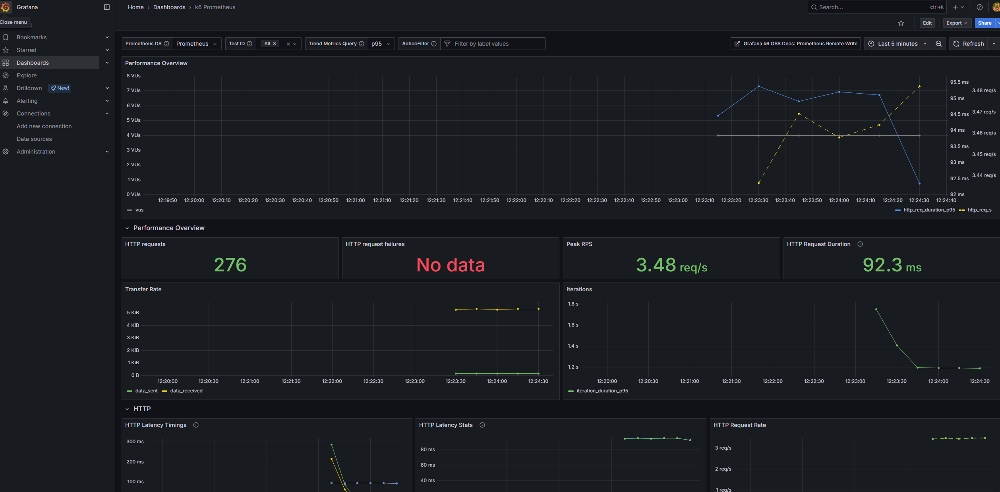

# ThrashBuddy


**_Thrash your Web-App until it hurts._**

---

## Overview

ThrashBuddy is a scalable, cloud-native framework for **distributed performance testing** using [k6](https://k6.io), backed by **Prometheus** for metrics storage and **Grafana** for real-time visualization. It’s designed to run in a containerized environment with **Docker** and **Kubernetes**, and leverages **[AWS EKS](https://aws.amazon.com/eks/)** (Elastic Kubernetes Service) to orchestrate distributed test execution across multiple pods. Of course it can easily be used in other kubernetes clusters as well, due to the simple Helm installation and additional installation scripts.

The infrastructure is provisioned and managed using **[eksctl](https://eksctl.io/)**, embracing an **Infrastructure as Code (IaC)** approach to ensure reproducibility, scalability, and easy deployment.

This setup provides a robust and automated performance testing platform by:

- 🧪 **Simulating large-scale traffic** with distributed k6 tests on AWS EKS
- 📊 **Viewing real-time metrics** via Grafana dashboards powered by Prometheus
- ⚙️ **Automating infrastructure provisioning** using eksctl and Docker
- ☁️ **Running tests in a cloud-native setup** that mirrors production environments

By adopting this approach, teams can validate performance early and often in the development lifecycle—reducing the risk of production failures and improving user satisfaction.




### Technology Map

The image below shows the used tools of this project:


## Getting Started

To get started with ThrashBuddy, see the [Getting Started Guide](docs/getting-started.md).
Entrypoint is anyway `./buddy.sh`, so feel free calling it to get a usage message.

```plaintext
Usage: ./buddy.sh <command-group> <command> [options]
```

More details at:

- [Getting Started Guide](docs/getting-started.md)
- [AWS Setup with EKS](docs/aws-eks.md)
- [GitHub Runner Setup](docs/github-runner.md)

## Performance Testing

**Performance testing** is a type of [non-functional testing](https://en.wikipedia.org/wiki/Non-functional_testing) that evaluates how a system behaves under expected or extreme workloads. It helps identify bottlenecks, ensures reliability, and verifies that your application meets key performance requirements before it reaches end users.

### Key Goals

- ✅ Ensure system **stability** under load
- ✅ Measure **response times**, **throughput**, and **resource usage**
- ✅ Detect **scalability issues** before they impact users
- ✅ Prevent outages and degraded user experiences in production

As systems grow more complex and distributed, running tests from a single machine no longer suffices. That’s where **distributed performance testing** comes in, offering more accurate, scalable, and production-like simulations.

## Features

- **[k6](https://k6.io)**: High-performance load testing tool with scripting in JavaScript.
- **[Prometheus](https://prometheus.io/)**: Time-series database.
- **[Grafana](https://grafana.com/)**: Interactive visualization platform to monitor and analyze test results.
- **[Docker](https://www.docker.com/)**: Containerized environments for consistent, repeatable deployments.
- **[AWS CLI](https://docs.aws.amazon.com/cli/latest/userguide/cli-chap-welcome.html)**: Automates creation of AWS components (e.g., ECR for storing Docker images).
- **[eksctl](https://eksctl.io/)**: Simplifies Kubernetes cluster management on AWS using IaC powered by CloudFormation.

## Contributing

Contributions are welcome! Whether it's a bug fix, new feature, or just improving the docs—open an issue or submit a pull request.

Before contributing, please check out our [Contributing Guide](CONTRIBUTING.md).

## License

This project is licensed under the [MIT License](LICENSE).
