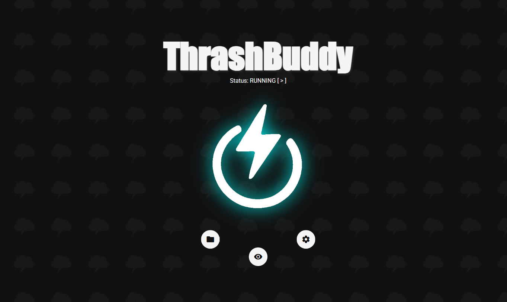

# CloudThrash

**_Thrash your Web-App until it hurts._**

## Overview

This repository provides a scalable and automated solution for **distributed performance testing** using [k6](https://k6.io/), integrated with **InfluxDB** for metrics storage and **Grafana** for real-time visualization. It is built to run in a containerized environment with **Docker**, and leverages **AWS EKS** (Elastic Kubernetes Service) for orchestrating distributed test execution across multiple pods.

The infrastructure is provisioned and managed using **EksCtl**, embracing an **Infrastructure as Code (IaC)** approach to ensure reproducibility, scalability, and ease of deployment.

Whether you're stress-testing APIs, simulating user loads, or validating system performance under heavy traffic, this setup provides a robust, cloud-native framework for running, observing, and analyzing performance tests at scale.

**Performance testing** is a type of software testing that evaluates how a system behaves under expected or extreme workloads. It helps identify bottlenecks, ensure reliability, and validate that applications meet performance criteria before going live.

Key goals of performance testing include:

- ✅ Ensuring system **stability** under load  
- ✅ Measuring **response times**, **throughput**, and **resource usage**  
- ✅ Detecting **scalability issues** before they impact users  
- ✅ Preventing outages and degraded user experiences in production

As systems grow in complexity and scale, simulating realistic user behavior from a single machine becomes a limitation. That's where **distributed performance testing** comes in.

This project allows you to:

- 🧪 **Simulate large-scale user traffic** by running k6 tests across multiple pods in AWS EKS  
- 📊 **Visualize metrics** in real-time with Grafana and InfluxDB  
- ⚙️ **Automate infrastructure** with EksCtl and Docker for reproducibility  
- ☁️ **Run tests in a cloud-native environment**, closer to your production architecture

By adopting this approach, teams can validate performance early and often in the development lifecycle—reducing the risk of failures in production and improving user satisfaction.

## Features

-   **k6**: Used for load testing and performance benchmarking.
-   **InfluxDB**: Time-series database for storing performance metrics.
-   **Grafana**: Visualization tool to create dynamic dashboards for performance monitoring.
-   **Docker**: Containerized environments for easy deployment.
-   **AWS CLI**: Creating bootsrap components in AWS, like ECR for OCI-based images (e.g. Docker)
-   **EksCtl**: Infrastructure as Code (IaC) to automate the setup of cloud resources (using CloudFormation in the background).

Technology Map:

## Contributing

Contributions are welcome! Please open an issue or submit a pull request for any enhancements or bug fixes.

## License

This project is licensed under the MIT License.
