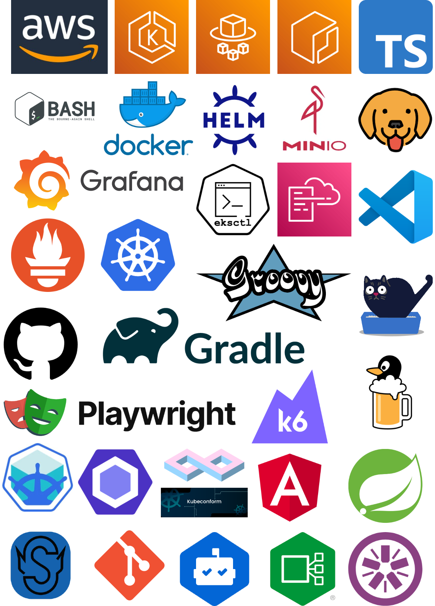

# CloudThrash

**_Thrash your Web-App until it hurts._**

---

## Overview

CloudThrash is a scalable, cloud-native framework for **distributed performance testing** using [k6](https://k6.io), backed by **InfluxDB** for metrics storage and **Grafana** for real-time visualization. It’s designed to run in a containerized environment with **Docker**, and leverages **[AWS EKS](https://aws.amazon.com/eks/)** (Elastic Kubernetes Service) to orchestrate distributed test execution across multiple pods.

The infrastructure is provisioned and managed using **[eksctl](https://eksctl.io/)**, embracing an **Infrastructure as Code (IaC)** approach to ensure reproducibility, scalability, and easy deployment.

This setup provides a robust and automated performance testing platform by:

- 🧪 **Simulating large-scale traffic** with distributed k6 tests on AWS EKS  
- 📊 **Viewing real-time metrics** via Grafana dashboards powered by InfluxDB  
- ⚙️ **Automating infrastructure provisioning** using eksctl and Docker  
- ☁️ **Running tests in a cloud-native setup** that mirrors production environments  

By adopting this approach, teams can validate performance early and often in the development lifecycle—reducing the risk of production failures and improving user satisfaction.

## Performance Testing

**Performance testing** is a type of [non-functional testing](https://en.wikipedia.org/wiki/Non-functional_testing) that evaluates how a system behaves under expected or extreme workloads. It helps identify bottlenecks, ensures reliability, and verifies that your application meets key performance requirements before it reaches end users.

### Key Goals

- ✅ Ensure system **stability** under load  
- ✅ Measure **response times**, **throughput**, and **resource usage**  
- ✅ Detect **scalability issues** before they impact users  
- ✅ Prevent outages and degraded user experiences in production  

As systems grow more complex and distributed, running tests from a single machine no longer suffices. That’s where **distributed performance testing** comes in—offering more accurate, scalable, and production-like simulations.

## Features

- **[k6](https://k6.io)**: High-performance load testing tool with scripting in JavaScript.
- **[InfluxDB 2](https://www.influxdata.com/)**: Time-series database optimized for real-time performance metrics.
- **[Grafana](https://grafana.com/)**: Interactive visualization platform to monitor and analyze test results.
- **[Docker](https://www.docker.com/)**: Containerized environments for consistent, repeatable deployments.
- **[AWS CLI](https://docs.aws.amazon.com/cli/latest/userguide/cli-chap-welcome.html)**: Automates creation of AWS components (e.g., ECR for storing Docker images).
- **[eksctl](https://eksctl.io/)**: Simplifies Kubernetes cluster management on AWS using IaC powered by CloudFormation.

### Technology Map

The image below shows the used tools of this project:

## Getting Started

To get started with CloudThrash, see the [Getting Started Guide](docs/getting-started.md) and [Architecture Overview](docs/architecture.md).

## Contributing

Contributions are welcome! Whether it's a bug fix, new feature, or just improving the docs—open an issue or submit a pull request.

Before contributing, please check out our [Contributing Guide](CONTRIBUTING.md).

## License

This project is licensed under the [MIT License](LICENSE).
