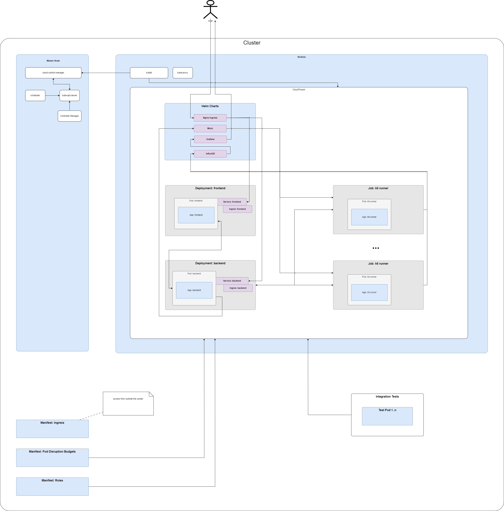

# Architecture

## Helm Charts

* nginx-ingress
* Minio
* InfluxDB
* Grafana

## Internal Components

* backend
* frontend
* k6 setup
* configurations:
  * roles
  * services
  * pod disruption budgets
  * ingress
